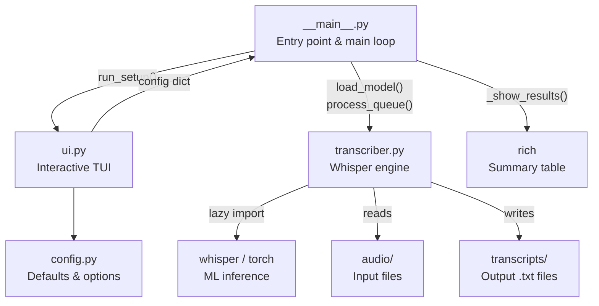

# Whisper Transcriber

A CLI tool that uses OpenAI's Whisper to batch-transcribe audio files. An interactive TUI lets you configure language, model, and output settings before each run.

---

## Features

- **Interactive TUI** -- language, model size, task, and per-file selection at runtime
- **Auto language detection** -- Whisper auto-detects from the first 30 seconds, or choose from 17 curated languages
- **Per-file selection** -- pick one or more audio files via multi-select checkbox
- **Queue processing** -- files are transcribed sequentially with per-file error recovery
- **Operation summary** -- results table showing per-file success/failure with error details after each run
- **Step navigation** -- Back/Exit options on every prompt with step indicators and context display
- **Overwrite protection** -- prompts before overwriting existing transcripts
- **Minimal output** -- `rich` progress bar only, no verbose transcription text
- **Persistent menu** -- returns to setup after each run or error; Ctrl+C to exit
- **Fast startup** -- Whisper/torch are lazy-loaded; TUI appears instantly

---

## Getting Started

### Prerequisites

- Python 3.10+
- [uv](https://docs.astral.sh/uv/getting-started/installation/) (Python package manager)
- ffmpeg

```bash
# Ubuntu/Debian
sudo apt install ffmpeg -y

# Install uv (if not already installed)
curl -LsSf https://astral.sh/uv/install.sh | sh
```

### Installation

```bash
git clone <repo-url> whisper-transcriber
cd whisper-transcriber
uv sync
```

### Running

```bash
uv run transcriber
```

Place audio files in the `audio/` directory (created automatically on first run). Transcripts are written to `transcripts/`.

---

## Project Structure

```
src/
├── __init__.py      # Package marker
├── __main__.py      # Entry point and main loop
├── config.py        # Defaults and option lists
├── transcriber.py   # Whisper transcription logic
└── ui.py            # TUI prompts with step navigation
audio/               # Input audio files (gitignored)
transcripts/         # Output transcripts (gitignored)
```

---

## System Architecture



**Data flow:** `main()` runs a loop of TUI setup followed by transcription. The UI module collects user preferences into a config dict without ever importing the transcriber. When the user confirms, `__main__` lazy-imports the transcriber module (which triggers `whisper`/`torch` loading), runs the queue, and displays results. This keeps TUI startup instant.

**Key constraint:** `ui.py` never imports `transcriber.py` -- this boundary enables lazy loading and keeps the TUI responsive.

---

## Output Format

Each transcript is a `.txt` file with timestamped segments:

```
[00:00:00] First segment of transcribed text.

[00:00:03] Second segment continues here.
```

---

## Model Reference

From the [Whisper repo](https://github.com/openai/whisper):

| Model  | VRAM   | Relative Speed | Accuracy |
| ------ | ------ | -------------- | -------- |
| tiny   | ~1 GB  | ~10x           | Lower    |
| base   | ~1 GB  | ~7x            | Fair     |
| small  | ~2 GB  | ~4x            | Good     |
| medium | ~5 GB  | ~2x            | Better   |
| large  | ~10 GB | 1x             | Best     |

---

## Supported Formats

`.m4a`, `.mp3`, `.wav`, `.flac`, `.ogg`, `.aac`, `.opus`, `.webm`

Any format decodable by ffmpeg can be processed by Whisper.

---
