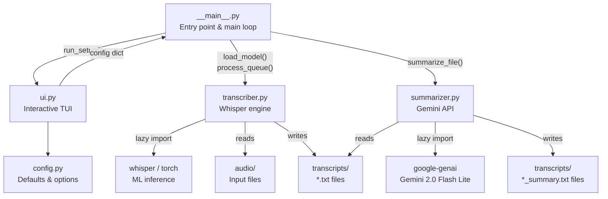

# Whisper Transcriber

A CLI tool that uses OpenAI's Whisper to batch-transcribe audio files with an optional Gemini AI summarizer. An interactive TUI lets you configure language, model, and output settings before each run.

---

## Features

- **Interactive TUI** -- language, model size, task, and per-file selection at runtime
- **Auto language detection** -- Whisper auto-detects from the first 30 seconds, or choose from 17 curated languages
- **AI summarization** -- optional Gemini-powered transcript summaries (concise or bullet points)
- **Per-file selection** -- pick one or more audio files with file sizes and transcript indicators
- **Queue processing** -- files are transcribed sequentially with per-file error recovery and time estimates
- **Operation summary** -- results table with transcription and summary status after each run
- **Step navigation** -- Back/Exit on every prompt with step indicators and context display
- **Overwrite protection** -- prompts before overwriting existing transcripts
- **Fast startup** -- Whisper/torch are lazy-loaded; TUI appears instantly
- **GPU detection** -- shows compute device and elapsed time after transcription
- **One-command setup** -- `setup.sh` handles all dependencies, system checks, and API key config

---

## Getting Started

### Quick Start (Recommended)

```bash
git clone <repo-url> whisper-transcriber
cd whisper-transcriber
bash setup.sh
```

The setup script will:
1. Verify Python 3.10+ and ffmpeg
2. Install `uv` if needed
3. Check GPU/CUDA availability, VRAM, RAM, and disk space
4. Install all dependencies via `uv sync`
5. Optionally configure a Gemini API key for AI summarization
6. Launch the transcriber

The script is idempotent -- rerunning it skips completed steps.

### Manual Setup

```bash
# Prerequisites: Python 3.10+, ffmpeg, uv
sudo apt install ffmpeg -y
curl -LsSf https://astral.sh/uv/install.sh | sh

# Install and run
git clone <repo-url> whisper-transcriber
cd whisper-transcriber
uv sync
uv run transcriber
```

Place audio files in the `audio/` directory (created automatically on first run). Transcripts are written to `transcripts/`.

---

## AI Summarization

Transcript summarization is powered by Google's Gemini 2.0 Flash Lite (free tier).

### Setup

1. Get a free API key at [Google AI Studio](https://aistudio.google.com/apikey)
2. Either run `bash setup.sh` (which prompts for the key), or create a `.env` file manually:
   ```
   GEMINI_API_KEY=your-key-here
   ```

### Usage

When a Gemini API key is configured, the task selection step shows additional options:
- **transcribe + summarize** -- transcribe then summarize
- **translate + summarize** -- translate to English then summarize

You can choose between two summary styles:
- **Concise summary** -- a brief paragraph capturing the key points
- **Bullet points** -- structured list of topics and takeaways

Summaries are saved as `filename_summary.txt` alongside the transcript `filename.txt`.

### Rate Limits

The free tier allows 15 requests/minute and 1,000 requests/day. The tool enforces a 4-second minimum between API calls automatically.

---

## Project Structure

```
src/
├── __init__.py      # Package marker
├── __main__.py      # Entry point and main loop
├── config.py        # Defaults and option lists
├── summarizer.py    # Gemini AI summarization
├── transcriber.py   # Whisper transcription logic
└── ui.py            # TUI prompts with step navigation
setup.sh             # One-time setup script
audio/               # Input audio files (gitignored)
transcripts/         # Output transcripts (gitignored)
```

---

## System Architecture



**Data flow:** `main()` loads `.env`, checks Gemini availability, then loops: TUI setup -> transcription -> optional summarization -> results. The UI module collects user preferences into a config dict without importing heavy modules. When the user confirms, `__main__` lazy-imports the transcriber (triggering `whisper`/`torch`), runs the queue, optionally summarizes via Gemini, and displays results.

**Key constraints:**
- `ui.py` never imports `transcriber.py` or `summarizer.py` -- keeps TUI instant
- `summarizer.py` lazy-imports `google.genai` inside `summarize_file()` only
- Summarization is fully optional -- gated on `GEMINI_API_KEY` presence

---

## Output Format

Each transcript is a `.txt` file with millisecond-precision timestamps:

```
[00:00:00.000] First segment of transcribed text.

[00:00:03.456] Second segment continues here.
```

When summarization is enabled, a companion `_summary.txt` file is created alongside each transcript.

---

## Model Reference

From the [Whisper repo](https://github.com/openai/whisper):

| Model  | VRAM   | Relative Speed | Accuracy |
| ------ | ------ | -------------- | -------- |
| tiny   | ~1 GB  | ~10x           | Lower    |
| base   | ~1 GB  | ~7x            | Fair     |
| small  | ~2 GB  | ~4x            | Good     |
| medium | ~5 GB  | ~2x            | Better   |
| large  | ~10 GB | 1x             | Best     |

---

## Supported Formats

`.m4a`, `.mp3`, `.wav`, `.flac`, `.ogg`, `.aac`, `.opus`, `.webm`

Any format decodable by ffmpeg can be processed by Whisper.

---
