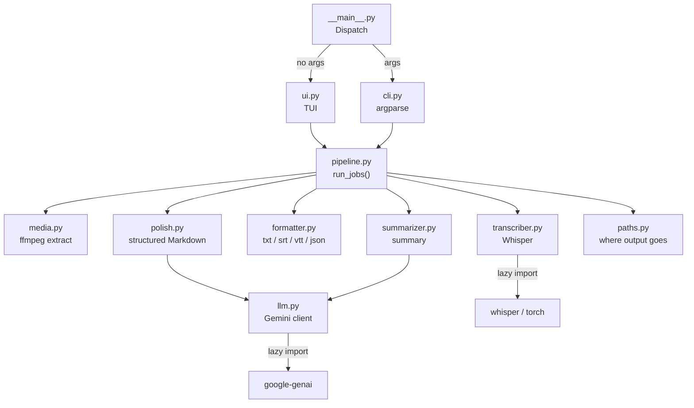

# Whisper Transcriber

Transcribe audio or video locally with OpenAI Whisper. Point it at any file anywhere -- video is
converted for you, and the transcript is written next to the input. An optional Gemini pass turns
the raw output into a structured Markdown document. Works headless for scripting, or through an
interactive TUI.

---

## Features

- **Any file, from anywhere** -- pass a path to audio, video, or a folder of either; no copying into an intake directory
- **Video handled automatically** -- audio is extracted with ffmpeg and cached, so you never run ffmpeg yourself
- **Output lands where you are** -- transcripts are written next to the input file, not buried in a project folder
- **Structured Markdown documents** -- an optional Gemini pass turns the raw transcript into a titled, sectioned document with a participants table, a proper-noun correction key, and a navigable table of contents
- **Headless CLI** -- `transcriber <file>` for scripting; no arguments opens the TUI
- **Multiple output formats** -- `txt`, `md`, `srt`, `vtt`, `json`
- **Interactive TUI** -- two questions to start; a summary screen shows every path before anything runs
- **AI summarization** -- optional Gemini-powered transcript summaries (concise or bullet points)
- **Auto language detection** -- Whisper detects from the first 30 seconds, or choose from 17 curated languages
- **Overwrite protection** -- existing outputs are skipped, and a fully-finished job never re-runs Whisper
- **Queue processing** -- files are processed sequentially with per-file error recovery
- **Fast startup** -- Whisper/torch are lazy-loaded; the TUI appears instantly
- **GPU detection** -- shows compute device and elapsed time
- **File management** -- view transcript previews, delete files
- **Settings editor** -- change defaults interactively
- **YAML config** -- all user presets in `config.yaml`
- **One-command setup** -- `setup.sh` handles dependencies, system checks, and API key config

---

## Requirements

### Hardware

| Component | Minimum           | Recommended                      |
| --------- | ----------------- | -------------------------------- |
| CPU       | Any modern x86_64 | Multi-core for faster processing |
| RAM       | 4 GB              | 8 GB+ (for medium/large models)  |
| GPU       | Not required      | NVIDIA CUDA-capable              |
| Disk      | ~5 GB             | ~10 GB (models cached locally)   |

#### VRAM by Model Size

| Model  | VRAM Required |
| ------ | ------------- |
| tiny   | ~1 GB         |
| base   | ~1 GB         |
| small  | ~2 GB         |
| medium | ~5 GB         |
| large  | ~10 GB        |

CPU-only transcription works for all model sizes but is significantly slower.

### Software

- Python 3.10 - 3.13
- ffmpeg
- uv (recommended) or pip

---

## Getting Started

### Quick Start (Recommended)

```bash
git clone <repo-url> whisper-transcriber
cd whisper-transcriber
bash setup.sh
```

The setup script will:

1. Verify Python 3.10+ and ffmpeg
2. Install `uv` if needed
3. Check GPU/CUDA availability, VRAM, RAM, and disk space
4. Install all dependencies via `uv sync`
5. Optionally configure a Gemini API key for AI summarization
6. Launch the transcriber

The script is idempotent -- rerunning it skips completed steps.

### Manual Setup

```bash
# Prerequisites: Python 3.10+, ffmpeg, uv
sudo apt install ffmpeg -y
curl -LsSf https://astral.sh/uv/install.sh | sh

# Install and run
git clone <repo-url> whisper-transcriber
cd whisper-transcriber
uv sync
uv run transcriber
```

Place audio files in the `audio/` directory (created automatically on first run). Transcripts are written to `transcripts/`.

---

## Usage

### Command line

```bash
transcriber meeting.mp4                    # transcript lands beside the video
transcriber talk.mp3 -f md --profile talk  # structured Markdown document
transcriber recordings/ -o ~/notes         # a whole folder, into one place
transcriber a.mp4 -f txt,md,srt            # several formats at once
transcriber call.mp4 --dry-run             # show what would be written
```

Common options:

| Option | Meaning |
| --- | --- |
| `-o, --output PATH` | File or directory to write to |
| `-f, --format FMT` | `txt`, `md`, `srt`, `vtt`, `json`, or `all`; comma-separated or repeated |
| `-m, --model SIZE` | `tiny`, `base`, `small`, `medium`, `large` |
| `-l, --language LANG` | Language code; omit to auto-detect |
| `--polish` | Produce the structured Markdown document (implies `-f md`) |
| `--profile` | `meeting`, `talk`, or `general` -- shapes the document |
| `--context TEXT` | Known names and spellings, to anchor proper nouns |
| `--summarize` | Also write a summary file |
| `--overwrite` | Replace existing outputs |
| `--dry-run` | List the output paths and stop |

Run `transcriber --help` for the full list.

### Where output goes

In priority order:

1. `-o/--output`, if given.
2. `transcripts/`, if the input came from the project's `audio/` library.
3. **Next to the input file**, otherwise.

So `transcriber ~/Videos/standup.mp4` leaves `standup.txt` in `~/Videos/`. Nothing to copy back.

### Video input

Video is converted to MP3 with ffmpeg before Whisper sees it. The extracted audio is cached in
`audio/` under the source name, so a second run on the same video skips the conversion. Use
`--no-keep-audio` to discard it instead. Bitrate (`audio_bitrate`, default `192k`) only affects the
kept copy -- Whisper resamples to 16 kHz mono regardless.

### Interactive TUI

Running `transcriber` with no arguments opens the TUI. It asks two questions -- where the recording
is, and which file -- then shows a summary screen listing every setting and every path it is about
to write. From there, start, or open **Change settings…** to adjust model, language, formats,
destination, document profile and context.

---

## Structured documents

`-f md` (or `--polish`) runs the transcript through Gemini to produce a document rather than a wall
of timestamps. Each one gets a title, a source/method note, a participants table, a proper-noun
correction key, a linked table of contents, topic sections with speaker-attributed turns, and a
closing summary shaped by the profile.

Long recordings are processed in overlapping windows, and each window is told the names and
spellings established by earlier ones, so section 9 does not rename someone introduced in section 1.

**`--context` is what makes name correction reliable.** Whisper mangles proper nouns badly; telling
it what to expect fixes most of them in one pass:

```bash
transcriber call.mp4 -f md \
  --context "Alex Toh and James of TDG Group; Anderson and Zijie of NexTalent. Partner: Xenber Sdn Bhd."
```

Two things to keep in mind:

- **Speakers are inferred, not detected.** Whisper does not diarise. The model attributes turns from
  content and falls back to "Speaker A" where the evidence is thin. Every generated document says so
  in its header.
- **The raw transcript is always written too.** The `.txt` is the source of truth, and a failed
  polish never costs you the transcription.

---

## AI Summarization

Summarization and document structuring are powered by Google's Gemini (`gemini-3.5-flash-lite` by
default; change `gemini_model` in `config.yaml`).

### Setup

1. Get a free API key at [Google AI Studio](https://aistudio.google.com/apikey)
2. Either run `bash setup.sh` (which prompts for the key), or create a `.env` file manually:
   ```
   GEMINI_API_KEY=your-key-here
   ```

### Usage

When a Gemini API key is configured, the task selection step shows additional options:

- **transcribe + summarize** -- transcribe then summarize
- **translate + summarize** -- translate to English then summarize

You can choose between two summary styles:

- **Concise summary** -- a brief paragraph capturing the key points
- **Bullet points** -- structured list of topics and takeaways

Summaries are saved as `filename_summary.txt` alongside the transcript `filename.txt`.

---

## Project Structure

```
src/
├── __init__.py      # Package marker
├── __main__.py      # Entry point; dispatches to CLI or TUI
├── cli.py           # Headless argument parsing and reporting
├── config.py        # YAML config loader with fallback defaults
├── files.py         # File management (view, delete)
├── formatter.py     # Render segments to txt/srt/vtt/json (pure functions)
├── home.py          # Home page with ASCII art and stats
├── llm.py           # Shared Gemini client, key loading, rate limiting
├── media.py         # ffprobe inspection and video-to-audio extraction
├── paths.py         # Output location rules
├── pipeline.py      # The one job runner, used by both front-ends
├── polish.py        # Two-pass LLM structuring into a Markdown document
├── prompts.py       # Prompts for the polish pipeline
├── settings.py      # Interactive settings editor
├── summarizer.py    # Gemini summarization
├── transcriber.py   # Whisper model loading and transcription
└── ui.py            # TUI prompts
tests/               # pytest suite; no model download or API key needed
config.yaml          # User-configurable presets
setup.sh             # One-time setup script
audio/               # Audio library and video-extraction cache
transcripts/         # Default output for files taken from audio/
```

---

## System Architecture


```mermaid
graph TD
    A["__main__.py\nDispatch"] -->|"no args"| B["ui.py\nTUI"]
    A -->|"args"| C["cli.py\nargparse"]
    B --> P["pipeline.py\nrun_jobs()"]
    C --> P
    P --> M["media.py\nffmpeg extract"]
    P --> T["transcriber.py\nWhisper"]
    P --> F["formatter.py\ntxt / srt / vtt / json"]
    P --> PO["polish.py\nstructured Markdown"]
    P --> S["summarizer.py\nsummary"]
    P --> PA["paths.py\nwhere output goes"]
    PO --> L["llm.py\nGemini client"]
    S --> L
    T -->|"lazy import"| W["whisper / torch"]
    L -->|"lazy import"| G["google-genai"]
```

**Data flow:** `main()` dispatches on argv. Both front-ends build a `JobOptions` and call
`pipeline.run_jobs()`, which for each file extracts audio if needed, transcribes once, then renders
every requested format from the same segment list. Polishing and summarization are additive passes
over that result.

**Key constraints:**

- `ui.py` and `cli.py` never import `transcriber.py`, `polish.py` or `summarizer.py` directly -- they
  go through `pipeline.py`, so the two front-ends cannot drift apart
- Heavy imports (`whisper`, `torch`, `google.genai`) happen inside functions, not at module load
- `formatter.py` and `paths.py` are pure -- no I/O beyond a final `write()`
- The raw `.txt` is written before any LLM pass, so an API failure never loses a transcription
- Gemini features are gated on `GEMINI_API_KEY`; everything else works without it

---

## Testing

```bash
uv run --group dev pytest
```

The suite mocks Whisper and Gemini, so it needs neither a model download nor an API key. ffmpeg-backed
tests generate their own fixtures and skip if ffmpeg is missing.

---

## Output Format

`txt` -- millisecond-precision timestamps, one turn per segment:

```
[00:00:00.000] First segment of transcribed text.

[00:00:03.456] Second segment continues here.
```

`md` -- a structured document: title, method note, participants, correction key, contents, topic
sections with speaker-attributed turns, closing summary.

`srt` / `vtt` -- subtitles. `json` -- segments with start/end times plus run metadata.

When summarization is enabled, a companion `_summary.txt` is written alongside.

---

## Model Reference

From the [Whisper repo](https://github.com/openai/whisper):

| Model  | VRAM   | Relative Speed | Accuracy |
| ------ | ------ | -------------- | -------- |
| tiny   | ~1 GB  | ~10x           | Lower    |
| base   | ~1 GB  | ~7x            | Fair     |
| small  | ~2 GB  | ~4x            | Good     |
| medium | ~5 GB  | ~2x            | Better   |
| large  | ~10 GB | 1x             | Best     |

---

## Supported Formats

**Audio:** `.m4a`, `.mp3`, `.wav`, `.flac`, `.ogg`, `.aac`, `.opus`, `.webm`

**Video:** `.mp4`, `.mkv`, `.mov`, `.avi`, `.m4v`, `.flv`, `.wmv`, `.ts`, `.mpg`, `.mpeg`

Video has its audio track extracted automatically. Both lists are configurable in `config.yaml`.

---
